# Infraestrutura como Código com Terraform na AWS

> **Atividade Ponderada — Módulo 10 (Engenharia de Software, Inteli)**
> Aula 2026-06-11 · "Como dialogar com o seu ambiente cloud?" · Prof. José Romualdo da Costa Filho
> Autor: Fernando Bertholdo · Turma 2026-1B-T13

Este repositório provisiona infraestrutura na AWS usando **Terraform** (Infraestrutura como Código), seguindo o tutorial oficial *Get Started — AWS* da HashiCorp. Além do tutorial, inclui um **provisionamento extra** que aplica o conceito ao contexto do projeto do módulo: o runner self-hosted do pipeline de CI/CD do drone PX4.

## O que é Infraestrutura como Código (IaC)

Em vez de clicar manualmente no console da AWS para criar servidores, descrevemos a infraestrutura desejada em **arquivos de configuração declarativos** (`.tf`). O Terraform lê esses arquivos, calcula o que precisa ser criado/alterado/destruído e executa na ordem correta, resolvendo dependências automaticamente. As vantagens: a infraestrutura fica **versionável** (entra no Git), **reproduzível** (mesmo resultado em qualquer máquina) e **auditável** (todo histórico de mudanças).

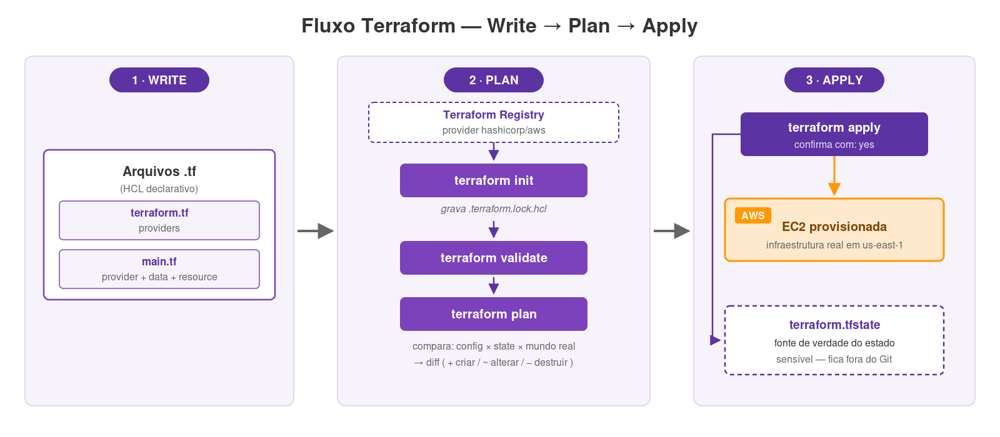

O fluxo tem três passos: **Write** (escrever os `.tf`) → **Plan** (revisar o diff que o Terraform propõe) → **Apply** (executar). O Terraform mantém um arquivo de estado (`terraform.tfstate`) que funciona como fonte de verdade do que existe de fato na nuvem.

## Estrutura do repositório

```
inteli-m10-terraform-iac/
├── learn-terraform-aws/        # 1. Tutorial oficial HashiCorp (EC2 única)
│   ├── terraform.tf            #    bloco terraform + required_providers
│   └── main.tf                 #    provider + data source AMI + resource EC2
├── extra-runner-px4/           # 2. EXTRA: runner self-hosted do pipeline PX4
│   ├── terraform.tf
│   ├── main.tf                 #    security group + EC2 com Docker via user_data
│   └── outputs.tf              #    id, ip público e AMI como outputs
├── docs/
│   ├── img/                    # prints e diagramas usados neste README
│   └── diagramas-src/          # SVGs-fonte dos diagramas (editáveis)
└── .gitignore                  # ignora *.tfstate, .terraform/, *.tfvars, *.pem
```

> **Por que o `.tfstate` não está versionado?** O arquivo de estado pode conter dados sensíveis (IPs, metadados, e em outros cenários até segredos). Por isso o `.gitignore` o exclui — boa prática recomendada pela própria HashiCorp.

---

## Parte 1 — Tutorial oficial (`learn-terraform-aws/`)

Provisiona uma instância EC2 Ubuntu na região `us-east-1`, exatamente como o tutorial [*Build infrastructure*](https://developer.hashicorp.com/terraform/tutorials/aws-get-started/aws-build).

### Setup do ambiente

Instalei o Terraform CLI e configurei as credenciais AWS como variáveis de ambiente (nunca dentro do código):

```bash
# instalação (exemplo Linux; no macOS: brew install hashicorp/tap/terraform)
terraform -version    # Terraform v1.10.5

# autenticação — credenciais via variáveis de ambiente
export AWS_ACCESS_KEY_ID="<sua-access-key>"
export AWS_SECRET_ACCESS_KEY="<sua-secret-key>"
export AWS_DEFAULT_REGION="us-east-1"
```

### Passo 1 — `terraform fmt` (formatação)

Padroniza a formatação dos arquivos `.tf` segundo o estilo recomendado.

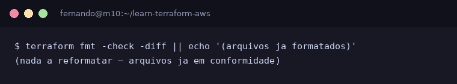

### Passo 2 — `terraform init` (inicialização)

Baixa o provider AWS declarado em `terraform.tf` e cria o lock file `.terraform.lock.hcl`, que trava a versão exata do provider para builds reproduzíveis.

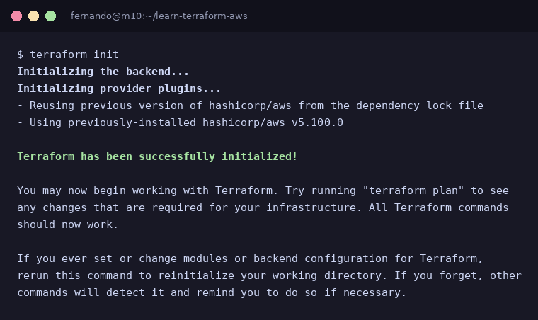

### Passo 3 — `terraform validate` (validação)

Verifica se a configuração é sintaticamente válida e internamente consistente.

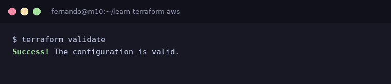

### Passo 4 — `terraform apply` (provisionamento)

O Terraform mostra o **plano de execução** (o que será criado, com `+`) e pede confirmação. Após `yes`, cria a instância na AWS.

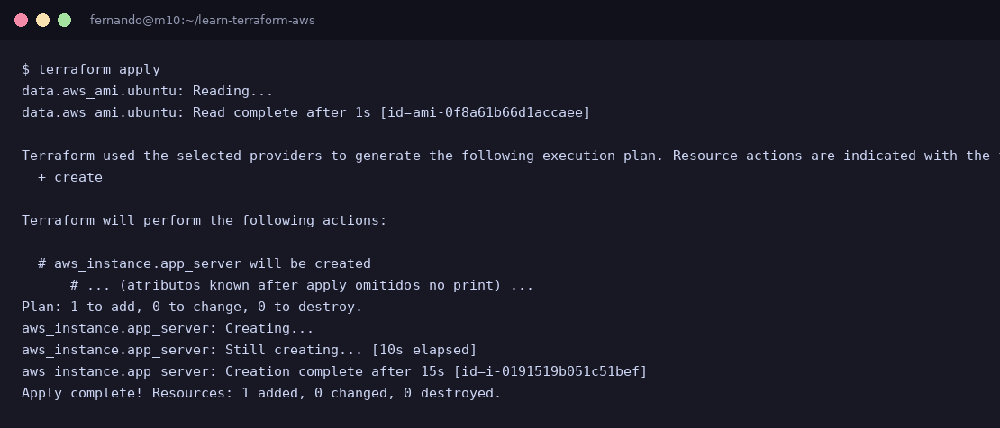

A instância foi criada em ~15s: `aws_instance.app_server [id=i-0191519b051c51bef]`.

### Passo 5 — Inspeção do estado

`terraform state list` lista os recursos rastreados; `terraform show` mostra o estado completo.

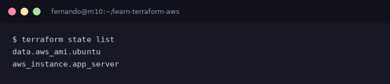

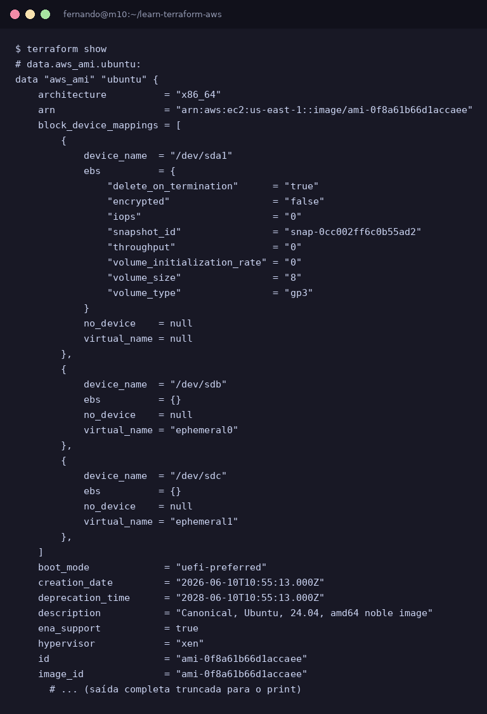

---

## Parte 2 — Itens provisionados na nuvem

Esta seção evidencia, conforme exigido, **o que foi efetivamente criado na AWS**. As duas instâncias rodando, confirmadas via `aws ec2 describe-instances`:

| Recurso | ID | Tipo | AMI | AZ | Origem |
|---|---|---|---|---|---|
| EC2 `app_server` | `i-0191519b051c51bef` | t3.micro | `ami-0f8a61b66d1accaee` (Ubuntu 24.04) | us-east-1c | Tutorial (Parte 1) |
| EC2 `px4_runner` | `i-00cdaa1ceb656bbba` | t3.micro | `ami-0f8a61b66d1accaee` (Ubuntu 24.04) | us-east-1c | Extra (Parte 3) |
| Security Group `px4-runner-ssh` | `sg-00adda87cfd5c035d` | — | — | — | Extra (Parte 3) |

Verificação direta pela AWS CLI, confirmando as duas instâncias em execução:

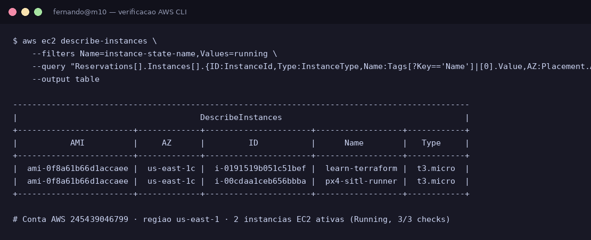

No **console gráfico da AWS** (EC2 → Instances), na conta `245439046799`, as mesmas duas instâncias aparecem como `Running` com `3/3 checks passed`: `learn-terraform` (`i-0191519b051c51bef`, IP `3.80.87.30`) e `px4-sitl-runner` (`i-00cdaa1ceb656bbba`, IP `3.89.163.52`), ambas `t3.micro` na AZ `us-east-1c`.

<!-- Para reforçar a evidência, cole aqui o screenshot do console gráfico:
 -->

---

## Parte 3 — EXTRA: runner self-hosted do pipeline PX4 (`extra-runner-px4/`)

> **Ir além:** este bloco conecta o tutorial ao projeto real do módulo. O grupo usa um pipeline de CI/CD que roda simulações do drone **PX4 SITL** em um runner *self-hosted* (a VM `srv-simulador`). A decisão por self-hosted está documentada nos ADRs 001/006 do repositório do professor ([`josercf/inteli-px4-cicd-demo`](https://github.com/josercf/inteli-px4-cicd-demo), branch `feat/pr8-terraform-runner`): o runner GitHub-hosted cancelava o job de simulação; self-hosted com cache local da imagem SITL resolveu. Aqui, **provisiono via IaC o papel dessa VM**, em vez de configurá-la na mão.

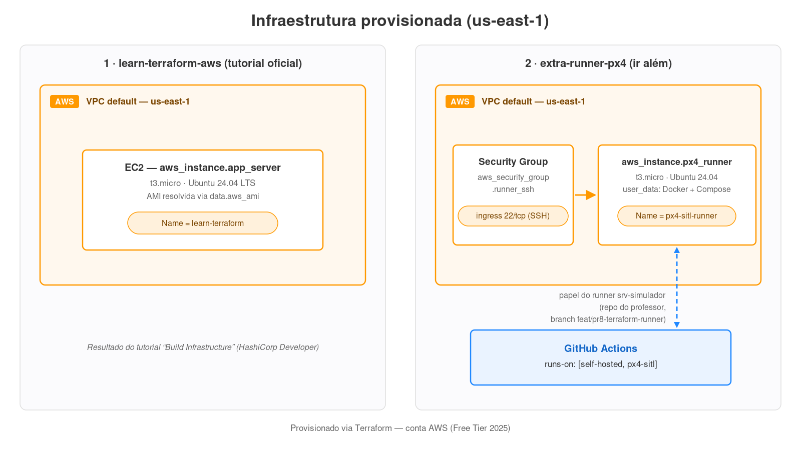

A config cria dois recursos além do data source:

- **`aws_security_group.runner_ssh`** — libera a porta 22 (SSH) para administração do runner, espelhando o acesso `ssh azureuser@srv-simulador` do walkthrough da aula 08.
- **`aws_instance.px4_runner`** — EC2 que, no primeiro boot, instala Docker + Compose via `user_data` (pré-requisito do job `mission-test`, que roda `docker compose up ... --exit-code-from tester`).

### Evidências de execução

```bash
terraform init      # baixa provider AWS
terraform validate  # Success! The configuration is valid.
terraform apply     # cria SG + EC2
```

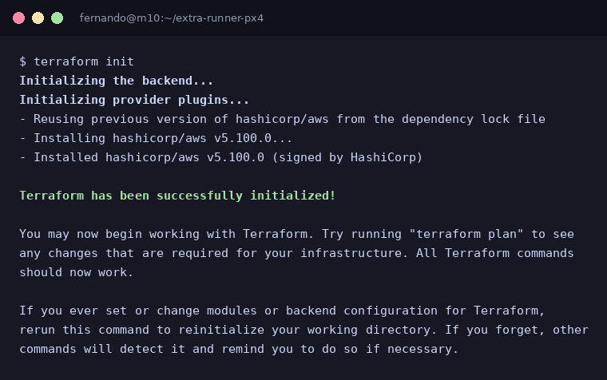

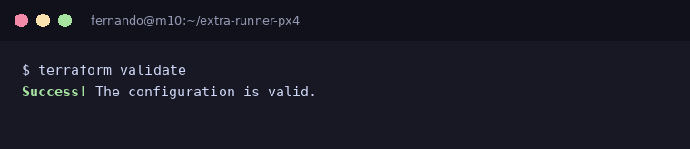

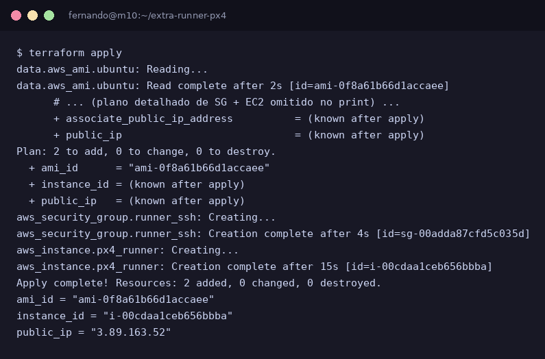

O `apply` criou os dois recursos e expôs os outputs definidos em `outputs.tf`:

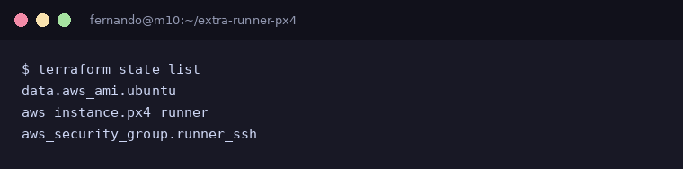

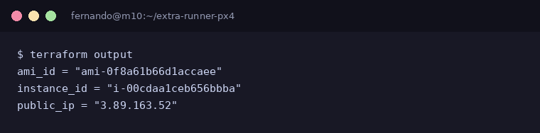

---

## Ciclo de vida completo — `terraform destroy`

Para não gerar custos e demonstrar o ciclo de vida completo do IaC, ambas as infraestruturas foram destruídas ao final. O `destroy` remove tudo o que o Terraform criou, na ordem inversa das dependências.

<!-- PRINT-DESTROY -->

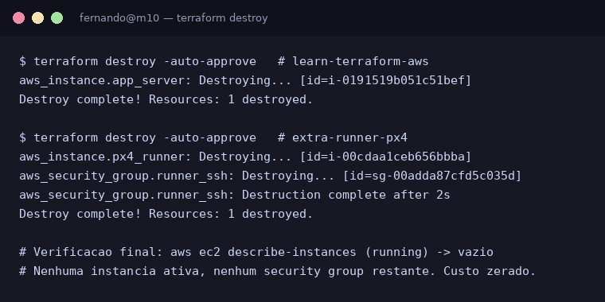

---

## Adaptações em relação ao tutorial

Registro honesto das diferenças entre o que o tutorial pede e o que foi executado, com a justificativa:

| Tutorial | Aqui | Por quê |
|---|---|---|
| Região `us-west-2` | `us-east-1` | Região padrão da conta usada; irrelevante para o aprendizado. |
| `instance_type = "t2.micro"` | `t3.micro` | O **novo Free Tier da AWS** (contas criadas em 2025) não aceita mais t2.micro — `RunInstances` retorna `InvalidParameterCombination: not eligible for Free Tier`. Confirmei os tipos elegíveis com `aws ec2 describe-instance-types --filters Name=free-tier-eligible,Values=true`; t3.micro é o equivalente x86_64 atual e roda a mesma AMI Ubuntu AMD64. |
| Conta AWS pessoal/free tier | idem | Usei conta AWS própria com um IAM user temporário (`terraform-temp`, política `AmazonEC2FullAccess`), deletado após a entrega. |

---

## Conceitos-chave demonstrados

- **Declarativo, não procedural** — descrevemos o *estado final* desejado; o Terraform decide *como* chegar lá.
- **Providers** — plugins que traduzem o `.tf` em chamadas de API (aqui, `hashicorp/aws ~> 5.92`).
- **Data sources** — `data.aws_ami.ubuntu` busca a AMI Ubuntu mais recente dinamicamente, evitando hardcode de ID que envelhece.
- **State file** — fonte de verdade do que existe; base de todo `plan`; mantido fora do Git por conter dados sensíveis.
- **Outputs** — expõem valores úteis após o apply (id, IP público) de forma programática.
- **Idempotência e ciclo de vida** — `apply` converge para o estado declarado; `destroy` reverte tudo.

## Referências

- Tutorial *Build/Create infrastructure* — https://developer.hashicorp.com/terraform/tutorials/aws-get-started/aws-build
- *What is Infrastructure as Code with Terraform?* — https://developer.hashicorp.com/terraform/tutorials/aws-get-started/infrastructure-as-code
- *Install Terraform* — https://developer.hashicorp.com/terraform/tutorials/aws-get-started/install-cli
- *O que é o Terraform?* (IBM) — https://www.ibm.com/br-pt/topics/terraform
- Pipeline PX4 de referência (repo do professor) — https://github.com/josercf/inteli-px4-cicd-demo (branch `feat/pr8-terraform-runner`)
